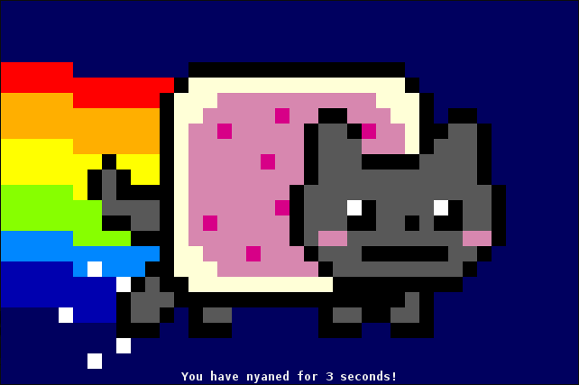

[](https://github.com/Stenstromen/phyaddr/actions/workflows/main.yml)[](https://github.com/Stenstromen/phyaddr/actions/workflows/snyk.yml)
# Nyanserv

[](./nyancat.png)

Dockerfile for klanges "Nyancat CLI", Telnet mode 

[github.com/klange](https://github.com/klange/nyancat)

Uses:
* alpine:latest
* inetd (busybox-extras)
* nyancat

Builds project from [github.com/klange](https://github.com/klange/nyancat) and deploys via inetd (busybox-extras)

## Demo

Demo available at Stenstromen/nyanserv. (linux/arm64)

```bash
docker run -d --rm -p 2323:2323 stenstromen/nyanserv:latest
```

## Clone

```bash
git clone https://github.com/Stenstromen/nyanserv.git
```

## Build

```bash
docker build -t nyanserv nyanserv/.
```

## Run

```bash
docker run -d --rm -p 2323:2323 nyanserv
```

## Connect

```bash
nc localhost 2323 || telnet localhost 2323
```
